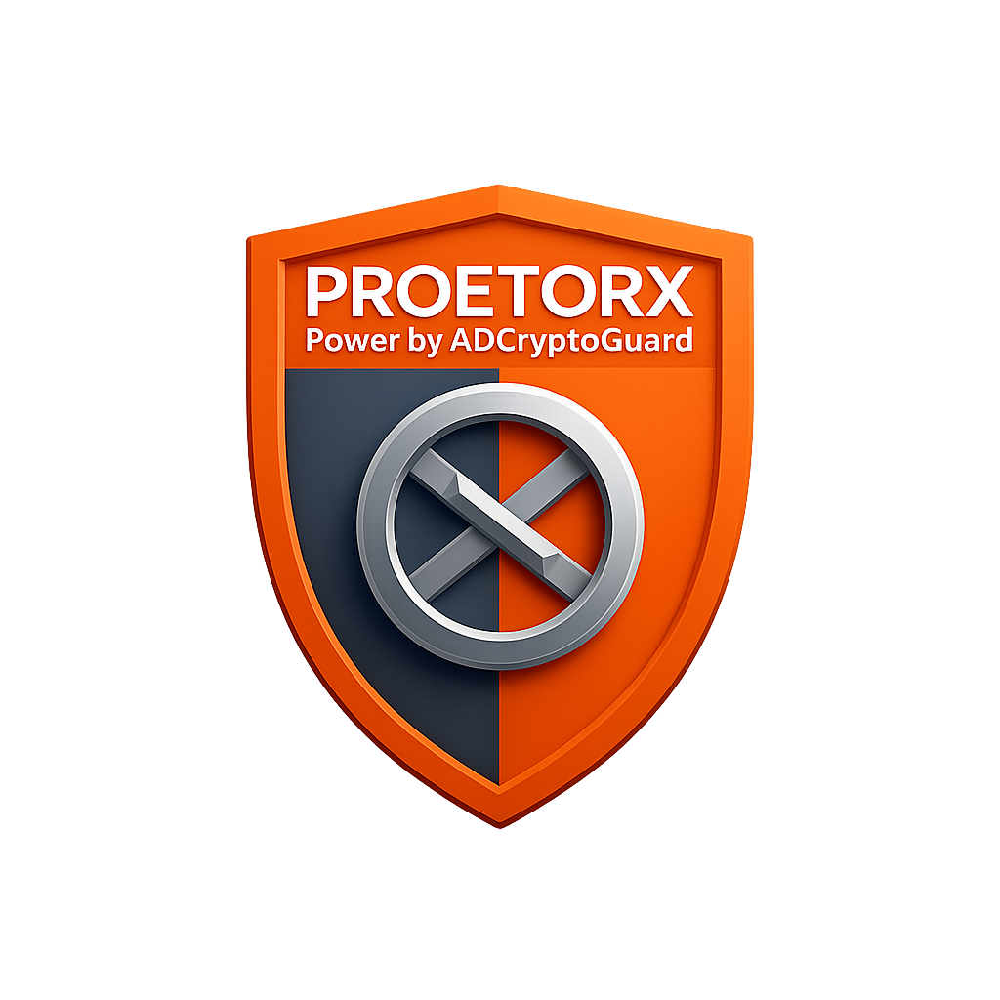

# PX – ProetorX Wallet Validator

  
[](https://sonarcloud.io/summary/new_code?id=yusriadib_proetorx-xrpl)
[](https://sonarcloud.io/summary/new_code?id=yusriadib_proetorx-xrpl)
[](https://sonarcloud.io/summary/new_code?id=yusriadib_proetorx-xrpl)

---

## Tagline
**Verified First, Trusted Later**

---

## Description

**ProetorX (PX)** is an open-source, compliance-first, stateless XRPL wallet validator and risk assessment engine powered by ADC CryptoGuard.

PX is designed for **Ripple XRPL Grants** and the **BDAX Accelerator**. It validates XRPL wallets, scores risk with AI, exports **ISO 20022** XML, and includes readiness for **Real-World Asset (RWA)** tokenization.

> PX is **not** a blockchain validator node — it is a **compliance layer**:
> - Validates and risk-scores wallets  
> - Detects scam/suspicious patterns  
> - Exports audit-ready XML in ISO 20022 for banks, auditors, and regulators

---

## Features

- **XRPL Wallet Validation** — balance, flags, owner count; robust API fallback  
- **AI Risk Scoring** — scikit-learn stub (v1); pluggable model (v2)  
- **ISO 20022 Export** — generate `pain.001` (and `pacs.008` roadmap) for compliance/reporting  
- **RWA Module** — eligibility stub (v2 expansion)  
- **Metrics Dashboard** — cumulative validations, avg response time, last items (anonymized)  
- **Stateless & Secure** — no sensitive data stored; strict headers/CORS; TLS-ready  
- **Modern UI** — responsive dark/light, clean components, quality badges  

---

## Why ISO 20022 Matters

ISO 20022 is the **global standard** for financial messaging used by banks, SWIFT, and regulators.

- Defines formats like `pain.001` (payment initiation) and `pacs.008` (payment clearing).
- Since 2025, **SWIFT and EU banks** have migrated to ISO 20022 for cross-border payments.
- Without ISO, blockchain data appears “alien” to banks — making adoption harder.

PX bridges this gap by **exporting XRPL wallet data directly in ISO 20022 XML**:

- Compliance officers can review blockchain transactions in familiar formats.
- Auditors can map blockchain data into existing banking systems.
- Regulators can trust blockchain data because it matches their standard.

---

## Architecture

```mermaid
flowchart TD
    A[User Input: Wallet Address] --> B[Frontend UI (HTML/JS + Tailwind)]
    B --> C[Backend API (FastAPI, stateless)]
    C --> D[XRPL Handler (3x RPC with rotation/fallback)]
    D --> E[Risk Engine (AI/ML risk scoring)]
    D --> F[ISO 20022 Export (pain.001 / pacs.008)]
    E --> G[RWA Module (stub → v2 eligibility)]
    F --> G
    G --> H[Metrics & Logs (JSON, anonymized)]
    H --> I[Dashboard (Validations, Scores, ISO files)]
```

---

## Team

- **Muhammad Yusri Adib** — Founder, ADCX Lab  
  Builder of ADC CryptoGuard, GuardianX (Kadena), HGuard (Hedera), and ProetorX (XRPL). Focus: blockchain safety, compliance, ISO 20022.
- **Muhammad Mustafa, CPA, CFE, CMA, CIA** — Co-Founder (Governance & Compliance)  
  Chartered Accountant & Licensed Auditor. Expertise: governance, ISO frameworks, financial intelligence.


---

## Roadmap

- **Milestone 1 (MVP):** Wallet validation, basic risk score, ISO XML export ✅
- **Milestone 2 (3–6 mo):** Supervised ML model, RWA eligibility v1, Sonar/InfoSec audit
- **Milestone 3 (6–12 mo):** Production deployment, enterprise API (keyed), observability (Sentry)
- **Milestone 4 (12–18 mo):** Multi-chain modules (ETH/Hedera/Kadena), ISO 20022 advanced (pacs.008, camt.053), pilots with FIs

---

## Use Cases

- **Compliance Officers:** Pre-transaction wallet checks; ISO XML export for audits
- **Auditors / Regulators:** Risk insights and standardized reporting
- **Financial Institutions:** Bridge XRPL data to banking systems (ISO 20022)
- **Developers / Communities:** Tooling for XRPL Malaysia & regional ecosystems


---

## Traction

**Current traction (early stage):**

- ✅ MVP deployed — live demo running on Render  
- ✅ Open-source repo active on GitHub with SonarCloud quality scans  
- ✅ 50+ repo clones and 200+ unique visitors (GitHub traffic, August 2025)  
- ✅ ISO 20022 `pain.001` XML export tested successfully  
- ✅ Built on top of ADCX Lab validator family (CryptoGuard XRPL, GuardianX Kadena, HGuard Hedera) — proven capability to ship multiple compliance tools  

> PX is positioned for ecosystem validation and adoption through BDAX Accelerator support.

---

## Roadmap & Scaling Plan

**Phase 1 (MVP – already live):**  
- XRPL wallet validation (balance, flags, owner count)  
- Basic AI stub for risk scoring  
- ISO 20022 `pain.001` XML export  
- Stateless backend (FastAPI) deployed on Render demo  

---

**Phase 2 (After funding, 3–6 months):**  
- Upgrade to supervised ML model (XGBoost / PyTorch with explainability)  
- RWA eligibility v1 + blacklist heuristics + destination tag checks  
- Security hardening: SonarQube scan, dependency audit, caching for XRPL APIs  

**Phase 3 (After funding, 6–12 months):**  
- Enterprise API gateway (API keys, rate-limit, SLA tiers)  
- Metrics database migration (Postgres) + observability dashboards  
- Strategic partnerships with fintech/remittance players  
- Optional on-prem deployment for enterprise users  

**Phase 4 (After funding, 12–18 months):**  
- ISO 20022 full suite (`pacs.008`, `camt.053`, advanced reporting)  
- Multi-chain expansion (ETH, Hedera, Kadena)  
- Pilots with banks, regulators, and RegTech providers in Malaysia & SEA  

---

> ✅ Current MVP shows feasibility.  
> 🚀 Grant funding will accelerate PX into a production-grade **compliance bridge** for XRPL and beyond.
> 
---

## Monetization

1. **Public Freemium**
    - Free: validate + basic risk score
    - Pro: advanced insights, ISO XML export, priority endpoints
2. **SaaS API Tiers**
    - Dev: $29/mo (10k validations + ISO export)
    - Business: $199/mo (higher limits + ISO export)
    - Enterprise: custom SLA, private endpoints, on-prem option
3. **Compliance-as-a-Service (B2B)**
    - Embed PX engine into fintech/remittance flows
    - Integrations with RegTech/AML tools
4. **Grants & Ecosystem Support**
    - XRPL Grants / BDAX seed to accelerate v2, then subscription revenue

---

## Setup

1. **Clone**
   ```sh
   git clone https://github.com/ADCoinX/ProetorX.git && cd ProetorX
   ```
2. **Install**
   ```sh
   pip install -r requirements.txt
   ```
3. **Run**
   ```sh
   uvicorn app:app --reload --port 8080
   ```
4. **Visit** [http://localhost:8080](http://localhost:8080)

---

## API Examples

**Validate Wallet**
```sh
curl -X POST http://localhost:8080/validate \
  -H 'Content-Type: application/json' \
  -d '{"wallet":"rEXAMPLEADDRESS"}'
```

**Export ISO XML**
```sh
curl -X POST http://localhost:8080/export_iso \
  -H 'Content-Type: application/json' \
  -d '{"wallet":"rEXAMPLEADDRESS"}' \
  -o pain001_rEXAMPLEADDRESS.xml
```

**Metrics**
```sh
curl http://localhost:8080/metrics
```

---

## Security & InfoSec

- Stateless processing (no private keys; no full address storage in metrics)
- Security headers + CSP; strict static serving; input sanitization
- CORS restricted to required methods/headers; TLS-ready deployment
- SonarCloud / dependency checks planned; logs anonymized

---

## Screenshots

Grant reviewers: Demo screenshots available on request.  
*(Replace this section with real UI screenshots once ready.)*

---

## Example ISO 20022 XML

PX can generate ISO 20022 pain.001 XML. Example:

```xml
<?xml version="1.0" encoding="UTF-8"?>
<Document xmlns="urn:iso:std:iso:20022:tech:xsd:pain.001.001.03">
  <CstmrCdtTrfInitn>
    <GrpHdr>
      <MsgId>PX-SAMPLE-20250906T000000Z</MsgId>
      <CreDtTm>2025-09-06T00:00:00Z</CreDtTm>
      <NbOfTxs>1</NbOfTxs>
      <CtrlSum>12.34</CtrlSum>
      <InitgPty>
        <Nm>PX Sample Generator</Nm>
      </InitgPty>
    </GrpHdr>
    <PmtInf>
      <PmtInfId>PX-PMT-001</PmtInfId>
      <PmtMtd>TRF</PmtMtd>
      <BtchBookg>false</BtchBookg>
      <NbOfTxs>1</NbOfTxs>
      <CtrlSum>12.34</CtrlSum>
      <ReqdExctnDt>2025-09-06</ReqdExctnDt>
      <Dbtr>
        <Nm>XRPL Wallet Debtor</Nm>
      </Dbtr>
      <DbtrAcct>
        <Id>
          <Othr>
            <Id>rEXAMPLEWALLETDEBTORXXXXXXXXXXXXXXX</Id>
          </Othr>
        </Id>
        <Ccy>XRP</Ccy>
      </DbtrAcct>
      <CdtTrfTxInf>
        <PmtId>
          <EndToEndId>PX-E2E-0001</EndToEndId>
        </PmtId>
        <Amt>
          <InstdAmt Ccy="XRP">12.34</InstdAmt>
        </Amt>
        <Cdtr>
          <Nm>XRPL Wallet Creditor</Nm>
        </Cdtr>
        <CdtrAcct>
          <Id>
            <Othr>
              <Id>rEXAMPLEWALLETCREDITORXXXXXXXXXXXX</Id>
            </Othr>
          </Id>
          <Ccy>XRP</Ccy>
        </CdtrAcct>
        <RmtInf>
          <Ustrd>Sample ISO 20022 payment initiation generated by PX</Ustrd>
        </RmtInf>
      </CdtTrfTxInf>
    </PmtInf>
  </CstmrCdtTrfInitn>
</Document>
```

---

## License

See [LICENSE](LICENSE).
